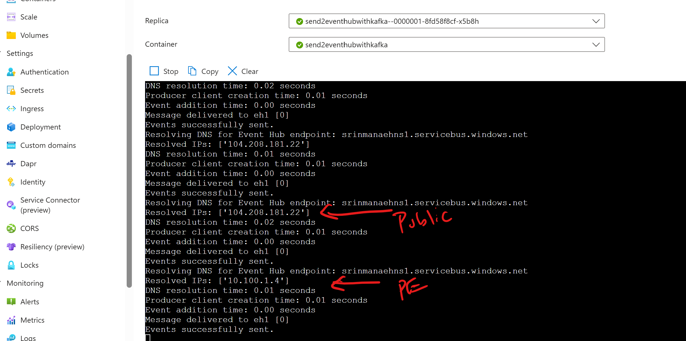

#  Azure Eventhub Connectivity - Samples 

## References

https://github.com/Azure/azure-event-hubs-for-kafka/tree/master/quickstart  


## Local dev to Eventhub with Kafka

 
## Eventhub producer  


### Run the program locally

Show environment variables. Please replace the values with your own and EXPORT to set.  For ACA, set environment variables in the portal or in the deployment.   
```bash
echo $EVENT_HUB_CONNECTION_STR 
Endpoint=sb://srinmanaehns1.servicebus.windows.net/;SharedAccessKeyName=RootManageSharedAccessKey;SharedAccessKey=abc1234567890=
echo $EVENT_HUB_NAME 
eh1
```

Test the connection   

```bash
python send1_aeh_debug.py
```

### Deploy the container to ACA.  


#### Build the container and push to ACR.  

```bash
az acr build --registry srinmantest --image send1_aeh_debug:v1 --file Dockerfile_send1_aeh_debug .
```

#### Deploy the container to ACA.  

Use portal and set environment variables.  

Check the logs (Log stream)


## Kafka producer

### Run the program locally

Show environment variables. Please replace the values with your own and EXPORT to set.  For ACA, set environment variables in the portal or in the deployment.   

```bash
echo $EVENT_HUB_CONNECTION_STR 
Endpoint=sb://srinmanaehns1.servicebus.windows.net/;SharedAccessKeyName=RootManageSharedAccessKey;SharedAccessKey=abc1234567890=
echo $KAFKA_BOOTSTRAP_SERVERS 
srinmanaehns1.servicebus.windows.net:9093
echo $EVENT_HUB_NAME 
eh1
```

Test the connection   

```bash
python send1_kafka_debug.py
```

### Deploy the container to ACA.

#### Build the container and push to ACR.  

```bash
az acr build --registry srinmantest --image send1_kafka_debug:v1 --file Dockerfile_send1_kafka_debug .
```

#### Deploy the container to ACA. 

Use portal and set environment variables.

Check the logs (Log stream)

## Additional testing with private endpoint  

Enable private endpoint for the eventhub namespace.    

  

You can notice the DNS is resolving to private endpoint IP. At this time, traffic is flowing through the private endpoint.  Disabling public endpoint will not affect the traffic.  

Disable the public endpoint.    

Local testing will fail unless DNS is setup resolve private endpoint IP and the private endpoint is accessible for ports including 9093.     


## Container build   

```bash
az acr build --registry srinmantest --image send1_aeh_debug:v1 --file Dockerfile_send1_aeh_debug .
az acr build --registry srinmantest --image send1_kafka_debug:v1 --file Dockerfile_send1_kafka_debug .
```